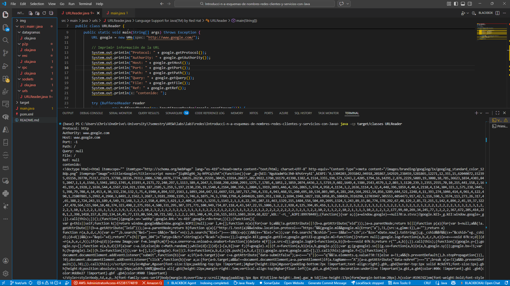
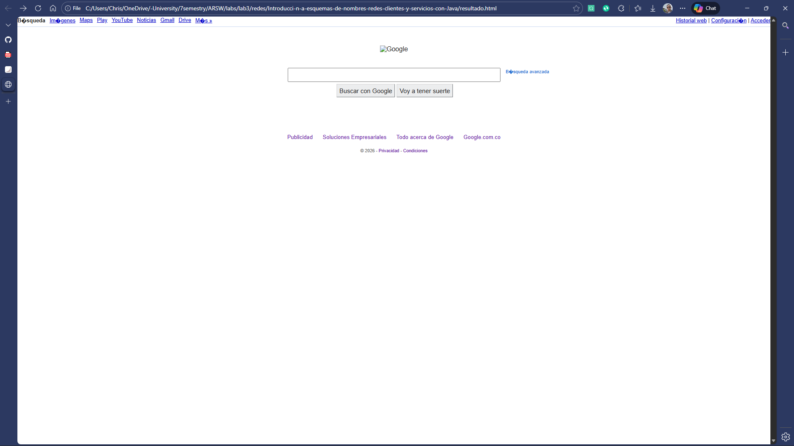
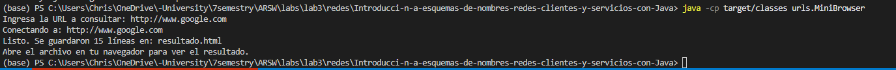
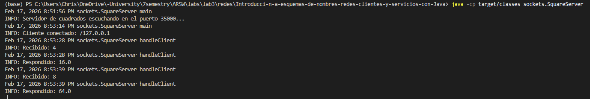
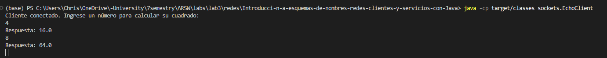
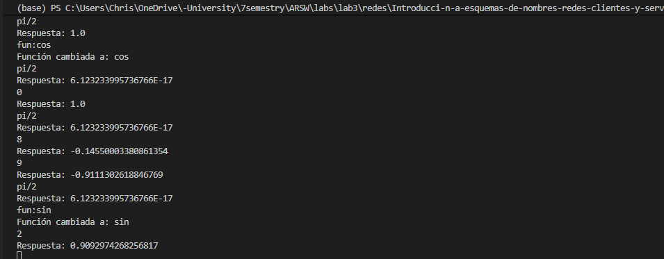
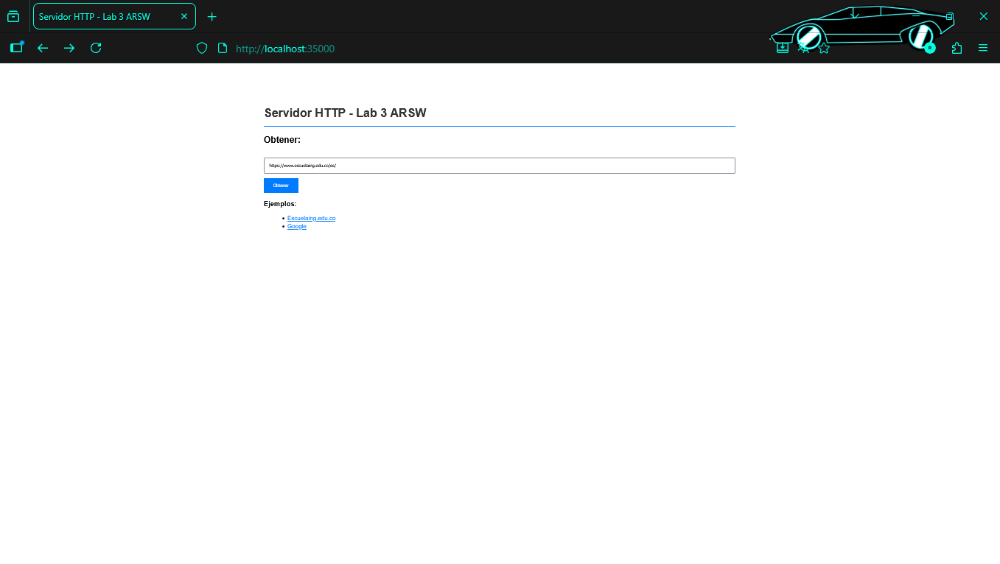
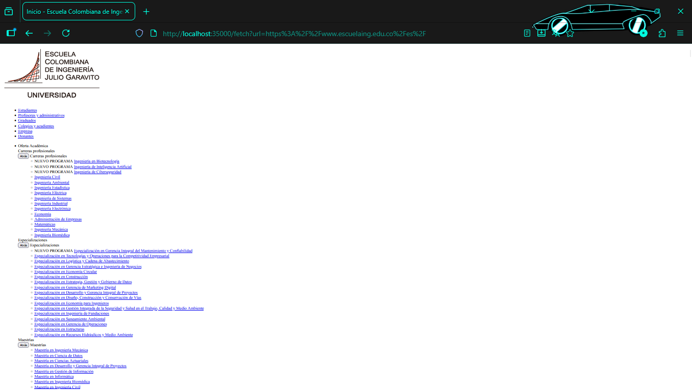
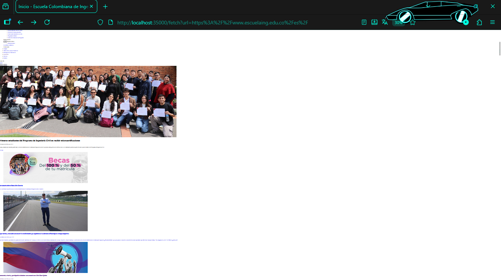

# Introducci-n-a-esquemas-de-nombres-redes-clientes-y-servicios-con-Java
Introducción a esquemas de nombres, redes, clientes y servicios con Java

---

## URLs

### Ejercicio 1 - Leyendo los valores de un objeto URL

## Ejercicio 1 - Leyendo los valores de un objeto URL

Implementamos los metodos sigueridos en la guia 
- **getProtocol:** Nos retorna el protocolo por el cual se realizo la consulta, por ejemplo http
- **getAuthority:** Nos retorna la direccion URI donde incluso se puede ver puerto y host
- **getHost:** Nos retorna el nombre host
- **get:** Nos retorna el puerto por donde se hace la consulta, en caso de no estar escrito, retorna -1
- **getPath:** Nos retorna la ruta del recurso
- **getQuery:** Nos retorna la consulta
- **getFile:** Nos retorna el path y el query
- **getRef:** Nos retorna el contenido de la pagina en formato `HTML`

**Como ejecutar:**
```bash
javac -d target/classes src/main/java/urls/URLReader.java
java -c -p target/classes urls.URLReader
```


### Ejercicio 2 - Mini Browser

Implementamos la clase `MiniBrowser`, que funciona como un navegador simple. La aplicación le pide al usuario una URL, hace un GET del contenido HTML de esa página y lo almacena en un archivo llamado `resultado.html` en la raíz del proyecto. Después se puede abrir ese archivo en un navegador para ver el resultado.

**Como ejecutar:**
```bash
javac -d target/classes src/main/java/urls/MiniBrowser.javSa
java -cp target/classes urClientels.MiniBrowser
```
El programa pedirá la URL por consola, por ejemplo: `https://www.escuelaing.edu.co/es/`




---

## Sockets

### Ejercicio - Servidor de cuadrados 

Se implementó un servidor que recibe un número por medio de sockets y responde con el cuadrado de ese número. El servidor escucha en el puerto `35000` y puede atender múltiples clientes uno tras otro. Se reutiliza el `EchoClient` como cliente para enviar los números.

**Como ejecutar:**
Server
```bash
javac -d target/classes src/main/java/sockets/SquareServer.java src/main/java/sockets/EchoClient.java
java -cp target/classes sockets.SquareServer
```
Cliente
```bash
java -cp target/classes sockets.EchoClient
```




### Ejercicio - Servidor trigonométrico 

Se implementó un servidor que recibe un número y responde con una operación trigonométrica. Por defecto calcula el **coseno**. El servidor acepta comandos con el prefijo `fun:` para cambiar la operación actual entre `sin`, `cos` y `tan`. También soporta el uso de `π` o `pi` y expresiones como `π/2`.


**Como ejecutar:**

Servidor:
```bash
javac -d target/classes src/main/java/sockets/TrigServer.java src/main/java/sockets/EchoClient.java
java -cp target/classes sockets.TrigServer
```

Cliente:
```bash
java -cp target/classes sockets.EchoClient
```



---

## HTTP Server

### Ejercicio - Servidor web con múltiples solicitudes

Partiendo del `HttpServer` básico que solo atendía una solicitud, se implementó un servidor web que soporta **múltiples solicitudes seguidas** (no concurrentes). El servidor puede retornar archivos HTML, CSS e imágenes desde el directorio `src/main/resources/webroot/`.

Además, el servidor integra la clase `MiniBrowser` para obtener contenido de páginas externas mediante la ruta `/fetch?url=`. 

**Características implementadas:**
- Loop `while(true)` para atender múltiples solicitudes sin cerrarse
- Parseo correcto de solicitudes HTTP (request line + headers)
- Servicio de archivos locales (HTML, CSS, JPG, PNG, GIF, etc.)
- Detección automática del Content-Type según la extensión del archivo
- Uso de `OutputStream` para archivos binarios (imágenes)
- Endpoint `/fetch?url=` que usa `MiniBrowser.fetchUrl()` para obtener páginas externas

**Como ejecutar:**
```bash
javac -d target/classes src/main/java/urls/MiniBrowser.java src/main/java/sockets/HttpServer.java
java -cp target/classes sockets.HttpServer
```

Luego abrir en el navegador: `http://localhost:35000`

Para servir imágenes, colocar los archivos (`.jpg`, `.png`, etc.) en la carpeta `src/main/resources/webroot/`





