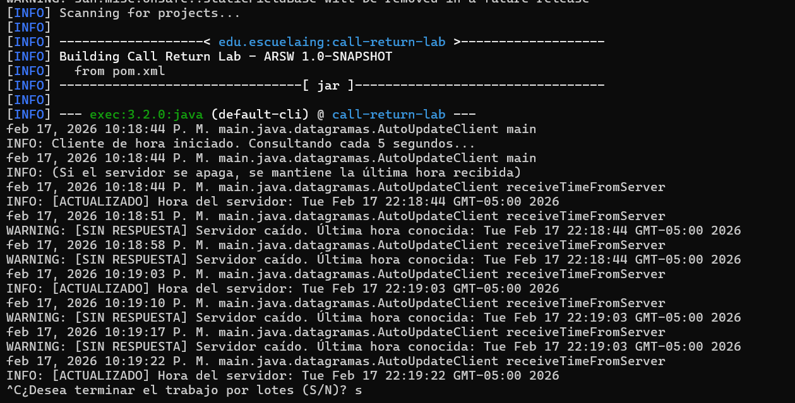
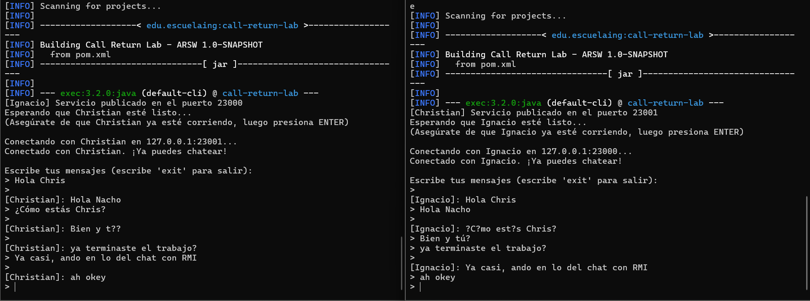
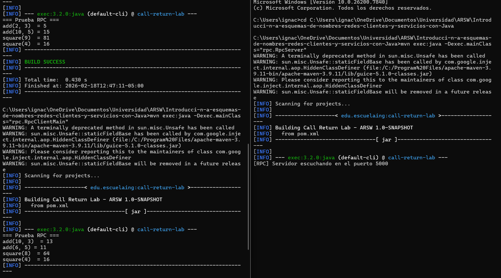
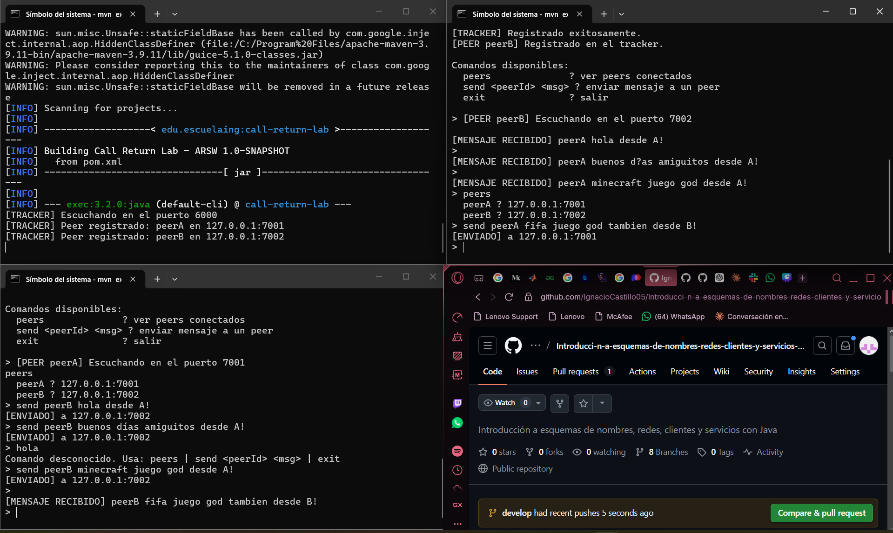

# Introduccion a esquemas de nombres, redes, clientes y servicios con Java

Laboratorio 3 - ARSW

Este proyecto cubre los principales mecanismos de comunicacion en red con Java: URLs, Sockets TCP, Datagramas UDP, RMI, RPC y P2P. Cada seccion tiene su propio paquete dentro de `src/main/java/`.


## Compilar todo el proyecto

```bash
mvn compile
```

---

## 1. URLs

### Ejercicio 1 - Leyendo los valores de un objeto URL

## Ejercicio 1 - Leyendo los valores de un objeto URL

Implementamos los metodos sigueridos en la guia 
- **getProtocol:** Nos retorna el protocolo por el cual se realizo la consulta, por ejemplo http
- **getAuthority:** Nos retorna la direccion URI donde incluso se puede ver puerto y host
- **getHost:** Nos retorna el nombre host
- **get:** Nos retorna el puerto por donde se hace la consulta, en caso de no estar escrito, retorna -1
- **getPath:** Nos retorna la ruta del recurso
- **getQuery:** Nos retorna la consulta
- **getFile:** Nos retorna el path y el query
- **getRef:** Nos retorna el contenido de la pagina en formato `HTML`

**Como ejecutar:**

```bash
mvn compile
mvn exec:java -Dexec.mainClass="urls.URLReader"
```

**Como probar:** al ejecutar se ve en consola la informacion de la URL y luego el HTML de Google.


---

### Ejercicio 2 - Mini Browser

Implementamos la clase `MiniBrowser`, que funciona como un navegador simple. La aplicación le pide al usuario una URL, hace un GET del contenido HTML de esa página y lo almacena en un archivo llamado `resultado.html` en la raíz del proyecto. Después se puede abrir ese archivo en un navegador para ver el resultado.

**Como ejecutar:**

```bash
javac -d target/classes src/main/java/urls/MiniBrowser.javSa
java -cp target/classes urClientels.MiniBrowser
```

**Como probar:** el programa pide una URL por consola. Ingresar por ejemplo `https://www.google.com` y luego abrir el archivo `resultado.html` que se genera en la raiz del proyecto.


---

## 2. Sockets TCP

### Ejercicio 4 - Servidor de cuadrados

Se implementó un servidor que recibe un número por medio de sockets y responde con el cuadrado de ese número. El servidor escucha en el puerto `35000` y puede atender múltiples clientes uno tras otro. Se reutiliza el `EchoClient` como cliente para enviar los números.

**Como ejecutar:**

Servidor:
```bash
javac -d target/classes src/main/java/sockets/SquareServer.java src/main/java/sockets/EchoClient.java
java -cp target/classes sockets.SquareServer
```

Cliente:
```bash
java -cp target/classes sockets.EchoClient
```

**Como probar:** en la terminal del cliente escribir un numero por ejemplo `5` y el servidor responde con `Respuesta: 25.0`. Si se escribe algo que no es numero, el servidor responde con un mensaje de error.


---

### Ejercicio 4 - Servidor trigonometrico

Se implemento un servidor `TrigServer` que recibe numeros y responde con el resultado de una operacion trigonometrica. Por defecto calcula el **coseno**. El servidor acepta comandos con el prefijo `fun:` para cambiar la operacion actual entre `sin`, `cos` y `tan`. Tambien soporta el uso de `pi` y expresiones como `pi/2`.

**Como ejecutar:**

Servidor:
```bash
javac -d target/classes src/main/java/sockets/TrigServer.java src/main/java/sockets/EchoClient.java
java -cp target/classes sockets.TrigServer
```

Terminal 2 - Cliente:
```bash
java -cp target/classes sockets.EchoClient
```

**Como probar:** escribir numeros en el cliente y verificar que la respuesta corresponde al coseno. Luego enviar `fun:sin` y verificar que cambia la operacion.


---

### Ejercicio 4 - Servidor web con multiples solicitudes

Partiendo del `HttpServer` basico del PDF que solo atendia una solicitud, se extendio para que soporte **multiples solicitudes seguidas** (no concurrentes). El servidor retorna archivos HTML, CSS e imagenes desde el directorio `src/main/resources/webroot/`.

Además, el servidor integra la clase `MiniBrowser` para obtener contenido de páginas externas mediante la ruta `/fetch?url=`. 

**Características implementadas:**
- Parseo correcto de solicitudes HTTP (request line + headers)
- Servicio de archivos locales (HTML, CSS, JPG, PNG, GIF, etc.)
- Detección automática del Content-Type según la extensión del archivo
- Uso de `OutputStream` para archivos binarios (imágenes)
- Endpoint `/fetch?url=` que usa `MiniBrowser.fetchUrl()` para obtener páginas externas

**Como ejecutar:**

```bash
mvn compile
mvn exec:java -Dexec.mainClass="sockets.HttpServer"
```

**Como probar:** abrir en el navegador `http://localhost:35000`. Se carga la pagina `index.html` desde `src/main/resources/webroot/`. Se puede usar el formulario para consultar paginas externas. Para probar imagenes, colocar archivos `.jpg` o `.png` en la carpeta `webroot/` y acceder a ellos directamente (por ejemplo `http://localhost:35000/foto.jpg`).


---

## 3. Datagramas UDP

### Ejercicio - Cliente con auto-actualizacion

Se implemento un cliente UDP (`AutoUpdateClient`) que consulta la hora a un servidor de datagramas (`DatagramTimeServer`) cada 5 segundos. Si el servidor no responde (porque se apago o se cayo), el cliente no se cierra sino que mantiene la ultima hora recibida y sigue intentando. Cuando el servidor vuelve a estar disponible, el cliente se actualiza automaticamente.

La clave de la implementacion esta en `socket.setSoTimeout(2000)`, que hace que si el servidor no responde en 2 segundos, el cliente no se quede esperando para siempre sino que capture la excepcion `SocketTimeoutException` y continue con la ultima hora conocida.

**Como ejecutar:**

Terminal 1 - Servidor:
```bash
mvn compile
mvn exec:java -Dexec.mainClass="datagramas.DatagramTimeServer"
```

Terminal 2 - Cliente:
```bash
mvn exec:java -Dexec.mainClass="datagramas.AutoUpdateClient"
```

**Como probar:** el cliente muestra la hora del servidor cada 5 segundos. Para probar la tolerancia a fallos, cerrar la terminal del servidor (Ctrl+C) y verificar que el cliente sigue corriendo mostrando el mensaje `[SIN RESPUESTA] Servidor caido. Ultima hora conocida: ...`. Luego volver a arrancar el servidor y verificar que el cliente se actualiza automaticamente.



---


### Ejercicio 6 - Chat usando RMI

Se implemento un aplicativo de chat usando RMI donde cada instancia es a la vez cliente y servidor. Cada instancia publica un objeto remoto `ChatServiceImpl` en su propio registry y busca el objeto remoto del otro usuario para enviarle mensajes.

**Clases implementadas:**:
- `rmi/chat/ChatService.java` - interfaz remota que define el metodo `receiveMessage`
- `rmi/chat/ChatServiceImpl.java` - implementacion que muestra los mensajes en consola
- `rmi/chat/ChatApp.java` - clase principal que publica el servicio, se conecta al otro usuario y permite chatear

Cada instancia crea su propio registry con `LocateRegistry.createRegistry()`, por lo que no es necesario correr el `rmiregistry` externo.

**Como ejecutar:**

Usuario A:
```bash
mvn compile
mvn exec:java -Dexec.mainClass="rmi.chat.ChatApp" -Dexec.args="Alice 23000 127.0.0.1 23001 Bob"
```

Usuario B:
```bash
mvn exec:java -Dexec.mainClass="rmi.chat.ChatApp" -Dexec.args="Bob 23001 127.0.0.1 23000 Alice"
```

El formato de los argumentos es: `<miNombre> <miPuerto> <ipDelOtro> <puertoDelOtro> <nombreDelOtro>`

**Como probar:** arrancar ambas terminales. Cada una muestra "Esperando que ... este listo... presiona ENTER". Una vez que ambas esten corriendo, presionar ENTER en cada terminal para establecer la conexion. Despues, escribir un mensaje en la terminal de Alice y verificar que aparece en la terminal de Bob, y viceversa. Escribir `exit` para cerrar el chat.



---

## 5. RPC - Llamada a procedimiento remoto

### Calculadora remota con RPC sobre sockets

Se implemento un sistema RPC (Remote Procedure Call) sobre sockets TCP. El servidor expone operaciones de una calculadora (`add` y `square`) y el cliente las llama como si fueran locales, usando un stub que se encarga de la comunicacion por debajo.

**Clases implementadas:**
- `rpc/CalculatorService.java` - interfaz que define las operaciones disponibles
- `rpc/CalculatorServiceImpl.java` - implementacion real de la logica
- `rpc/RpcProtocol.java` - protocolo de texto plano para request/response
- `rpc/RpcServer.java` - servidor que recibe las peticiones y despacha a la implementacion
- `rpc/CalculatorClientStub.java` - stub del cliente que traduce llamadas locales a mensajes de red
- `rpc/RpcClientMain.java` - main de prueba que usa el stub

El protocolo de comunicacion usa texto plano con formato `id=<uuid>;method=add;params=2,3` para los requests y `id=<uuid>;ok=true;result=5` para los responses.

**Como ejecutar:**

Terminal 1 - Servidor (puerto 5000):
```bash
mvn compile
mvn exec:java -Dexec.mainClass="rpc.RpcServer"
```

Terminal 2 - Cliente:
```bash
mvn exec:java -Dexec.mainClass="rpc.RpcClientMain"
```

**Como probar:** arrancar el servidor primero, luego el cliente. El cliente ejecuta varias operaciones y muestra los resultados



---

## 6. P2P - Red de pares con Tracker

### Comunicacion Peer-to-Peer

Se implemento una red P2P con un tracker central para descubrimiento. El tracker solo mantiene la lista de peers conectados; la comunicacion real entre peers es directa por TCP.

**Clases implementadas:**
- `p2p/TrackerServer.java` - servidor tracker que registra peers y responde consultas (puerto 6000)
- `p2p/TrackerClient.java` - cliente para comunicarse con el tracker
- `p2p/PeerNode.java` - nodo peer que es a la vez servidor y cliente
- `p2p/PeerMain.java` - clase principal para arrancar un peer

Cada peer al arrancar se registra en el tracker. Luego puede consultar que peers estan conectados y enviarles mensajes directamente sin pasar por el tracker.

**Como ejecutar:**

Terminal 1:
```bash
mvn compile
mvn exec:java -Dexec.mainClass="p2p.TrackerServer"
```

Terminal 2:
```bash
mvn exec:java -Dexec.mainClass="p2p.PeerMain" -Dexec.args="peerA 7001 127.0.0.1"
```

Terminal 3:
```bash
mvn exec:java -Dexec.mainClass="p2p.PeerMain" -Dexec.args="peerB 7002 127.0.0.1"
```

**Como probar:** una vez que ambos peers esten corriendo, en la consola de peerA:
- Escribir `peers` para ver la lista de peers conectados
- Escribir `send peerB hola desde A` para enviar un mensaje a peerB
- En la terminal de peerB aparece: `[MENSAJE RECIBIDO] peerA hola desde A`
- Escribir `exit` para cerrar un peer



---

## Estructura del proyecto


```
|   .gitignore
|   main.java
|   pom.xml
|   README.md
|   resultado.html
|
+---img
|       ejercicio1.png
|       ejercicio2.1.png
|       ejercicio2.png
|       ejercicio5Datagrama.png
|       ejercicio6RMI.png
|       ejercicio7RPC.png
|       ejercicio8P2P.png
|       httpserver1.png
|       httpserver2.png
|       httpserver3.png
|       sockets1.png
|       sockets2.png
|       sockets3.png
|
+---src
|   +---main
|   |   +---java
|   |   |   +---datagramas
|   |   |   |       AutoUpdateClient.java
|   |   |   |       DatagramTimeClient.java
|   |   |   |       DatagramTimeServer.java
|   |   |   |
|   |   |   +---p2p
|   |   |   |       PeerMain.java
|   |   |   |       PeerNode.java
|   |   |   |       TrackerClient.java
|   |   |   |       TrackerServer.java
|   |   |   |
|   |   |   +---rmi
|   |   |   |   |   EchoClient.java
|   |   |   |   |   EchoServer.java
|   |   |   |   |   EchoServerImpl.java
|   |   |   |   |
|   |   |   |   \---chat
|   |   |   |           ChatApp.java
|   |   |   |           ChatService.java
|   |   |   |           ChatServiceImpl.java
|   |   |   |
|   |   |   +---rpc
|   |   |   |       CalculatorClientStub.java
|   |   |   |       CalculatorService.java
|   |   |   |       CalculatorServiceImpl.java
|   |   |   |       RpcClientMain.java
|   |   |   |       RpcProtocol.java
|   |   |   |       RpcServer.java
|   |   |   |
|   |   |   +---sockets
|   |   |   |       EchoClient.java
|   |   |   |       EchoServer.java
|   |   |   |       HttpServer.java
|   |   |   |       SocketsApp.java
|   |   |   |       SquareServer.java
|   |   |   |       TrigServer.java
|   |   |   |
|   |   |   \---urls
|   |   |           MiniBrowser.java
|   |   |           URLReader.java
|   |   |
|   |   \---resources
|   |       \---webroot
|   |               index.html
|   |               style.css
|   |
|   \---test
|       \---java
\---target
    +---classes
    |   +---datagramas
    |   |       AutoUpdateClient.class
    |   |       DatagramTimeClient.class
    |   |       DatagramTimeServer.class
    |   |
    |   +---main
    |   |   \---java
    |   |       \---datagramas
    |   |               AutoUpdateClient.class
    |   |               DatagramTimeClient.class
    |   |               DatagramTimeServer.class
    |   |
    |   +---p2p
    |   |       PeerMain.class
    |   |       PeerNode.class
    |   |       TrackerClient$HostPort.class
    |   |       TrackerClient.class
    |   |       TrackerServer$PeerInfo.class
    |   |       TrackerServer.class
    |   |
    |   +---rmi
    |   |   |   EchoClient.class
    |   |   |   EchoServer.class
    |   |   |   EchoServerImpl.class
    |   |   |
    |   |   \---chat
    |   |           ChatApp.class
    |   |           ChatService.class
    |   |           ChatServiceImpl.class
    |   |
    |   +---rpc
    |   |       CalculatorClientStub.class
    |   |       CalculatorService.class
    |   |       CalculatorServiceImpl.class
    |   |       RpcClientMain.class
    |   |       RpcProtocol.class
    |   |       RpcServer.class
    |   |
    |   +---sockets
    |   |       EchoClient.class
    |   |       EchoServer.class
    |   |       HttpServer.class
    |   |       SocketsApp.class
    |   |       SquareServer.class
    |   |       TrigServer.class
    |   |
    |   +---src
    |   |   \---main
    |   |       \---java
    |   |           \---sockets
    |   |                   EchoServer.class
    |   |
    |   +---urls
    |   |       MiniBrowser.class
    |   |       URLReader.class
    |   |
    |   \---webroot
    |           index.html
    |           style.css
    |
    +---generated-sources
    |   \---annotations
    +---maven-status
    |   \---maven-compiler-plugin
    |       \---compile
    |           \---default-compile
    |                   createdFiles.lst
    |                   inputFiles.lst
    |
    \---test-classes
```