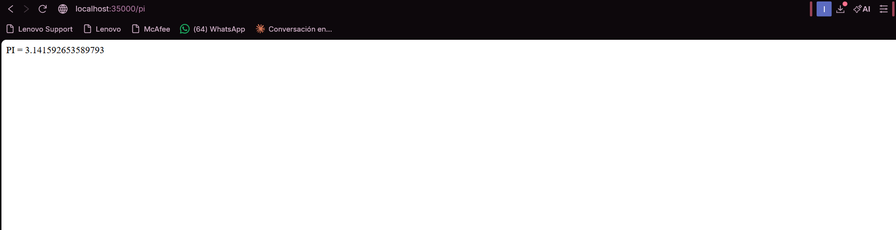
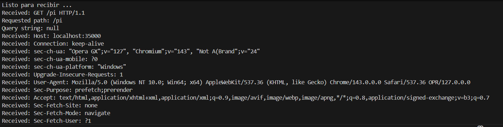
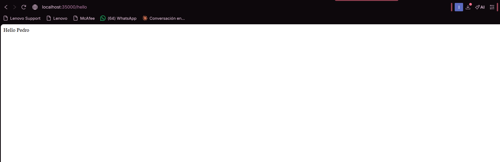
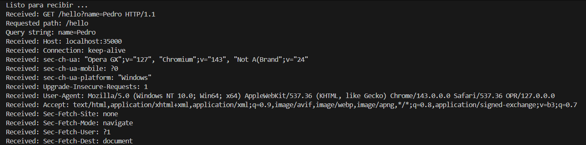
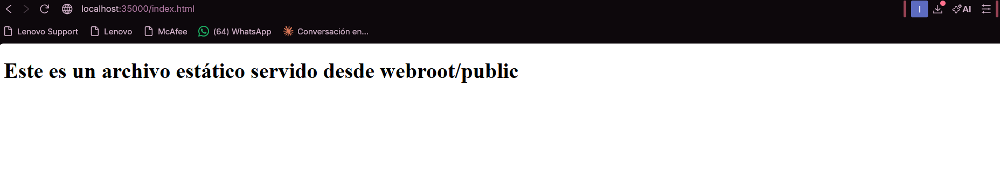
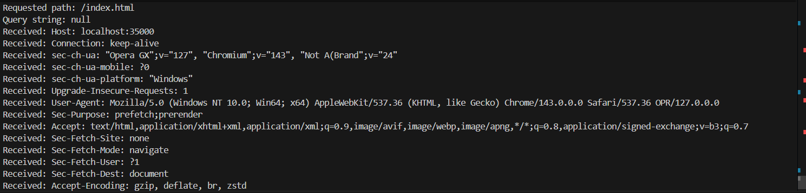

# Introduccion a esquemas de nombres, redes, clientes y servicios con Java

Laboratorio TDSE - Microframework Web

---

## Lightweight REST Framework (HelloWebApp)

A minimal web framework built on top of raw Java sockets, inspired by Spark/Express. It allows developers to define REST endpoints and serve static files using a clean, lambda-based API. The main classes involved are `HttpServerOriginal`, `Request`, `Response`, `WebMethod`, and `HelloWebApp`.

---

### GET Static Method for REST Services

The `get()` method lets developers register REST routes mapped to lambda expressions. Each lambda receives a `Request` and `Response` object and returns the response body as a `String`.

This approach separates the framework logic from the application logic: `HttpServerOriginal` handles the low-level socket communication, HTTP parsing, and response formatting, while the developer only needs to define what each route should return. The `WebMethod` interface acts as a functional interface, making it compatible with Java lambda syntax. When a request comes in, the server looks up the path in the endpoints map and delegates execution to the corresponding lambda.
```java
HttpServerOriginal.get("/hello", (req, res) -> "hello world!");
HttpServerOriginal.get("/pi",    (req, res) -> "PI = " + Math.PI);
HttpServerOriginal.get("/frommethod", (req, res) -> euler());
```

Internally, routes are stored in a `HashMap<String, WebMethod>` and matched against the request path on every incoming connection.





---

### Query Value Extraction

The `Request` class parses the query string from the URL automatically. Values are accessible via `req.getValues("paramName")`.

When the server receives an HTTP request, it extracts the query string from the URI (the part after `?`) and passes it to the `Request` constructor. The `parseQueryParams()` method splits the string by `&` and then by `=`, storing each key-value pair in a `HashMap`. This allows any registered endpoint to access query parameters without manually parsing the raw URL, making it straightforward to build dynamic, parameterized responses.
```java
HttpServerOriginal.get("/hello", (req, res) -> "Hello " + req.getValues("name"));
```

For a request to `http://localhost:35000/hello?name=Kike`, the server responds with `Hello Kike`.





---

### Static File Location

The `staticfiles()` method sets the folder where static files are served from. The framework looks for files under `target/classes/<specified-path>`.
```java
HttpServerOriginal.staticfiles("webroot/public");
```

Static files (HTML, CSS, images, etc.) placed under `src/main/resources/webroot/public/` are compiled into `target/classes/webroot/public/` by Maven and served directly. Before checking the registered endpoints, the server first attempts to locate the requested path as a physical file inside the configured static folder. If the file exists, it reads its bytes, detects the appropriate `Content-Type` based on the file extension, and writes the full HTTP response including headers. This means static files always take priority over registered endpoints, which is the expected behavior for serving frontend assets alongside a REST API.





---

### Example Application

To demonstrate how a developer would build an application on top of the framework, the `HelloWebApp` class serves as a complete working example. It shows all three framework features used together: registering endpoints with lambdas, reading query parameters, and serving static files.
```java
public class HelloWebApp {
    public static void main(String[] args) throws IOException, URISyntaxException {
        HttpServerOriginal.get("/hello", (req, res) -> "Hello " + req.getValues("name"));
        HttpServerOriginal.get("/frommethod", (req, res) -> euler());
        HttpServerOriginal.get("/pi", (req, res) -> "PI = " + Math.PI);

        HttpServerOriginal.staticfiles("webroot/public");

        HttpServerOriginal.main(args);
    }

    public static String euler() {
        return "e = " + Math.E;
    }
}
```

The application registers three REST endpoints and delegates the server startup to `HttpServerOriginal`. Notice that `euler()` is a regular Java method called from a lambda — this illustrates that endpoint logic can be as simple or as complex as needed, and can call any existing business logic without coupling it to the framework. The static files configuration ensures that the frontend assets in `webroot/public/` are also available alongside the REST routes.


### How to Run
```bash
mvn compile
mvn exec:java -Dexec.mainClass="sockets.HelloWebApp"
```

Then open your browser and try:

- `http://localhost:35000/hello?name=Kike`
- `http://localhost:35000/pi`
- `http://localhost:35000/frommethod`
- `http://localhost:35000/index.html` (static file)

